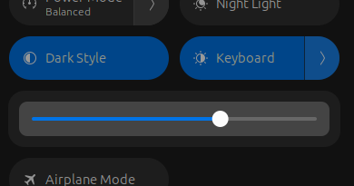

# Samsung Galaxybook Extras

Samsung Galaxybook Linux platform driver and accompanying utilities.

The intent is to somewhat replicate in Linux what Samsung has done in Windows with what I think the following components are doing:

- **Samsung System Event Controller**: an ACPI driver that interacts with their `SCAI` ACPI device in order to control a lot of these settings.
- **Samsung System Platform Engine**: a service which runs in the background to handle a few things including (I think) things like automatically turning off the keyboard backlight after a configured idle timer, etc.
- **Samsung Settings**: GUI application to configure all of the different available features.

## Platform Driver

This is a new and (currently) completely out-of-tree kernel platform driver intended to mimic what the **Samsung System Event Controller** seems to be doing in Windows (namely, communicate with the `SCAI` ACPI device in order to control these extra features). Once more features have been added and it has been tested then my intention was to try and submit the driver to be added to the kernel.

`cd` over to the [driver/](./driver/) folder and follow the README there for compiling and installing the module.

The following features are currently implemented:

- Keyboard backlight

I have found the following features in my other traces and suspect it might be possible to implement endpoints to control these as well (requires additional debugging and development):

- "Dolby Atmos" mode for the speakers
- Performance modes (High performance, Optimized, Quiet, Silent)
- Battery saver (stop charging at 85%)
- Start device automatically when opening lid
- USB ports provide charging when device is turned off

### Keyboard backlight

A new LED class called `samsung-galaxybook::kbd_backlight` is created which can be controlled via `sysfs` at `/sys/class/leds/samsung-galaxybook::kbd_backlight/brightness` (values 0 to 3) or by many of the standard utilities such as `brightnessctl`, `light`, etc.

It also seems to be picked up automatically in GNOME 45.x in the panel, where you can click the arrow beside `Keyboard` and adjust the slider:



I have also included a simple `toggle-keyboard-brightness` script along with the "extras" package as well as remapped the keyboard key Fn+F9 so that it will execute this script (assuming you are using GNOME).

Note that the setting "automatically turn off the keyboard backlight after X seconds" in Windows is actually controlled by Samsung's application service and not by the device driver itself; if such a feature is desired then it would need to be a similar software-based solution (e.g. added to the "extras" or something).

## Galaxybook Extras

The "extras" I have added here will be intended to mimic some of the functionality that the windows Samsung Settings application and service provide for this device.

Currently I have just created a few simple shell scripts which provide the following functionality:

- Toggle keyboard brightness level
- Toggle camera on/off
- Correct some of the keyboard mappings
- Add GNOME Custom Keyboard Shortcuts to 

Once you have built, installed, and loaded the platform driver then you can also make use of these "extras". The various scripts and configuration files can be installed using the [install-extras.sh](./install-extras.sh) script.

It could be possible to build some sort of service or more robust solution going forward, but this "quick and dirty" sort of works for now!

For notifications based on hotkey presses, I have just relied on `notify-send` which is also not ideal, but for a quick solution it does work for now.

## Keyboard scancode remapping

The provided file [61-keyboard-samsung-galaxybook.hwdb](./resources/61-keyboard-samsung-galaxybook.hwdb) will correct some keyboard mappings as follows:

- The "Settings" key (Fn+F1) is mapped to `prog1` so it can later be mapped as a custom keyboard shortcut
- The "Touchpad toggle" key (Fn+F5) is mapped to `F21` as this is typically recognized in Linux as the touchpad toggle key (tested as working in GNOME 45.x)
- The "Keyboard backlight" key (Fn+F9) is a multie-level toggle key which does not work in the same way as the standard on/off toggle or up+down keys which are available. So instead, this has been mapped to `prog2` so that it can be mapped as a custom keyboard shortcut and then some additional software (e.g. a script or service) can handle the different levels.
- The "Camera privacy toggle" key (Fn+F10) is mapped to `prog3` so it can also be mapped to a custom keyboard shortcut

### Matching additional device keyboards

Currently, these keyboard mapping rules will only apply specifically for the Galaxy Book2 Pro with pn 950XED, but it is suspected that they can and should apply to several other of the more recent Galaxybook models.

You can get your own device's evdev dmi string like this:

```sh
sudo evemu-describe
```

Select the device for your "regular" keyboard (e.g. "/dev/input/event2: AT Translated Set 2 keyboard") and then you should see the full DMI string for your keyboard, like this:

```sh
# EVEMU 1.3
# Kernel: 6.5.0-13-generic
# DMI: dmi:bvnAmericanMegatrendsInternational,LLC.:bvrP11RGF.057.230404.ZQ:bd04/04/2023:br5.25:svnSAMSUNGELECTRONICSCO.,LTD.:pn950XED:pvrP11RGF:rvnSAMSUNGELECTRONICSCO.,LTD.:rnNP950XED-KA2SE:rvrSGLB208A0U-C01-G001-S0001+10.0.22000:cvnSAMSUNGELECTRONICSCO.,LTD.:ct10:cvrN/A:skuSCAI-ICPS-A5A5-ADLP-PRGF:
# Input device name: "AT Translated Set 2 keyboard"
# Input device ID: bus 0x11 vendor 0x01 product 0x01 version 0xab41
# ...
# Properties:
N: AT Translated Set 2 keyboard
I: 0011 0001 0001 ab41
```

The filter string in the hwdb file will need to modified so that it also matches your device. If you wish then you can create an issue here with the output of your `evemu-describe` and I can try to modify the file for you.

Otherwise, feel free to test yourself by modifying `/etc/udev/hwdb.d/61-keyboard-samsung-galaxybook.hwdb` and either restart or reload udev as follows:

```sh
sudo systemd-hwdb update
sudo udevadm trigger
```

Once we can put together a more definitive filter that supports more devices then I think it would make sense to ask for this keyboard mapping to get moved to systemd upstream. See: <https://github.com/systemd/systemd/blob/main/hwdb.d/60-keyboard.hwdb>
